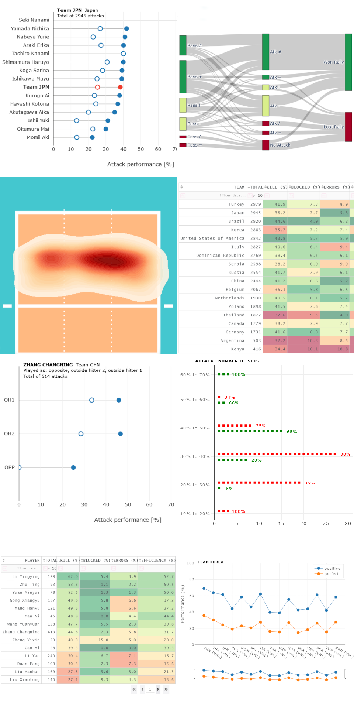
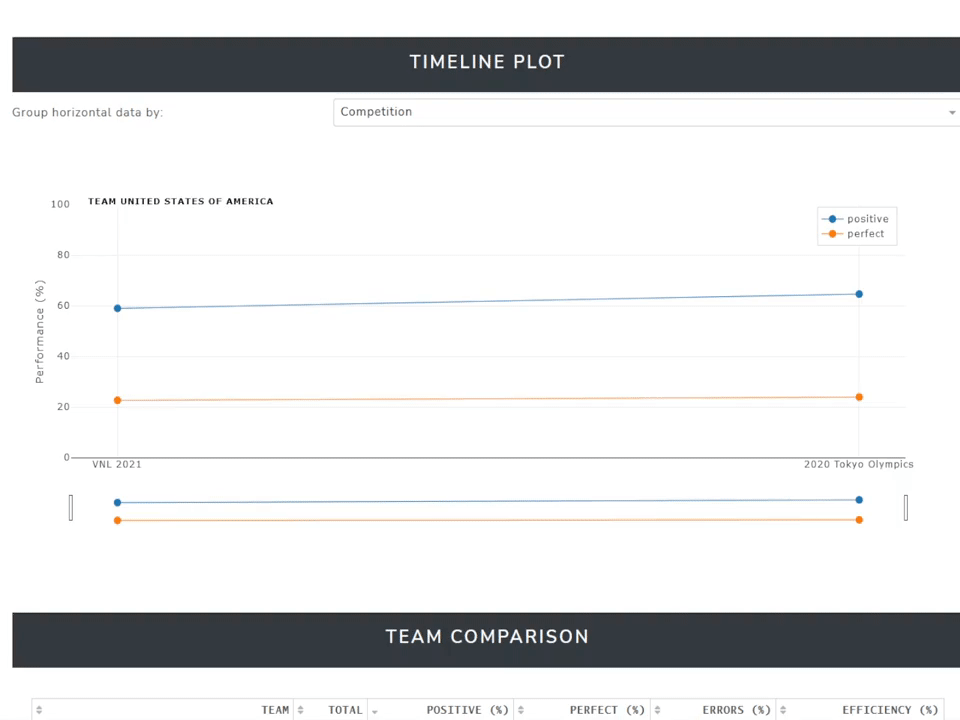
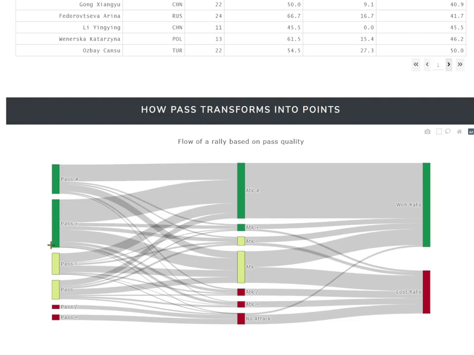
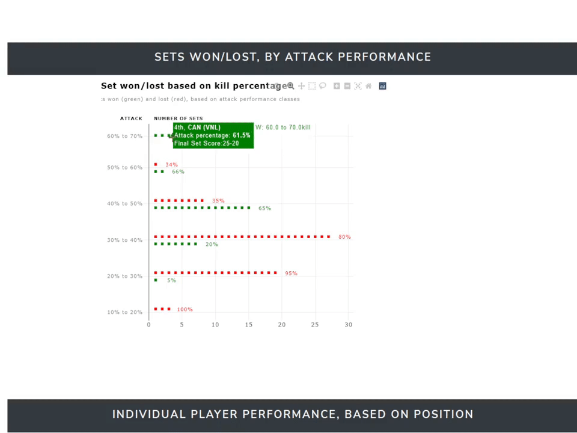
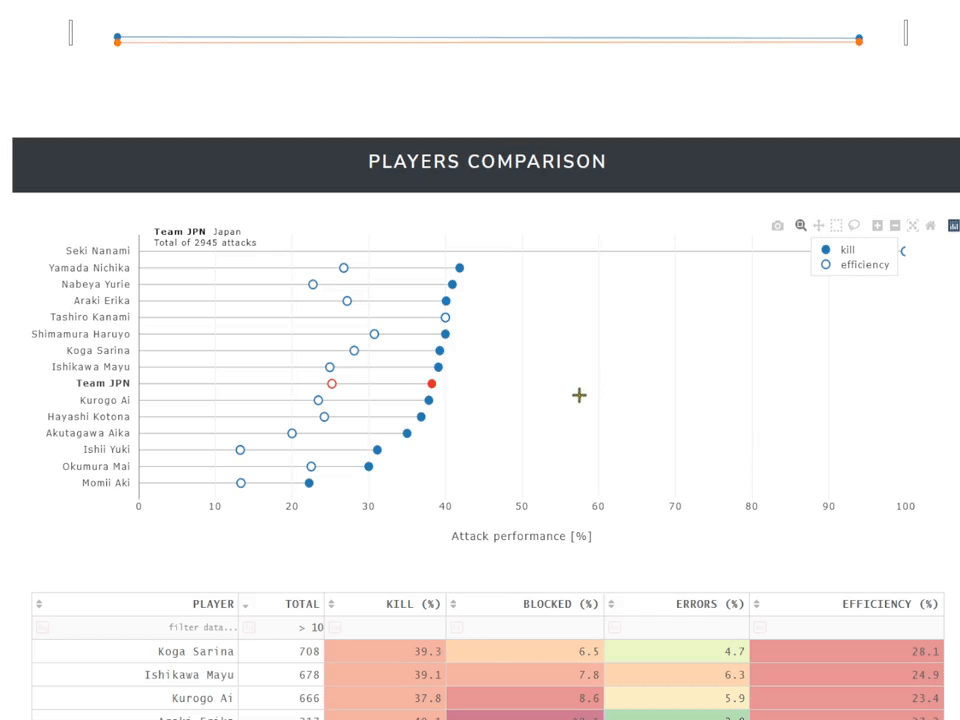
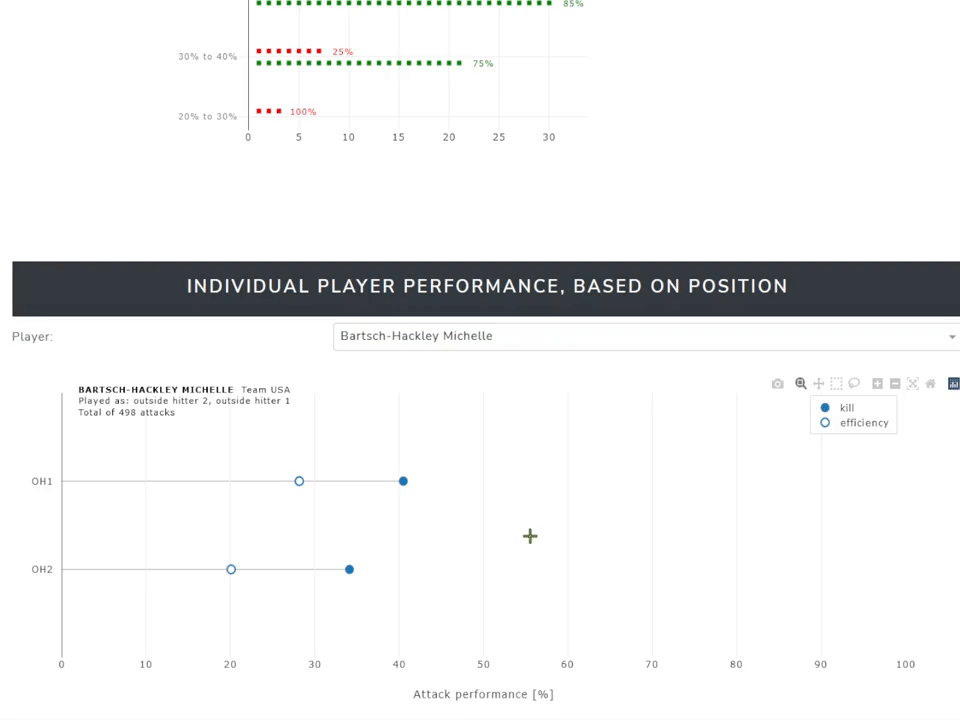

# VPVNext
Interactive dashboard for volleyball data.

This is an app developed with [**Dash**](https://dash.plotly.com/) and deployed on [**Heroku**](https://www.heroku.com/home).

**Link to the app: **

 

  

## Explore the timeline of the performance

 

## Investigate the flow of a sideout rally

 

## Find how the attack percentage impacted the times you won a set

 

## Compare the performance of the players in a team

 

## Compare the performance of a player in different position compared to others in the same role

